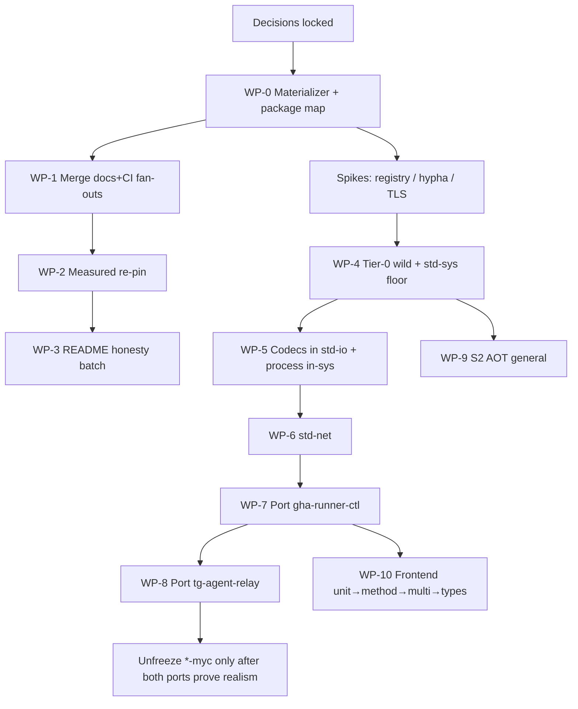

# Execution plan — Mycelium Rust train (2026-08-01)

Derived from [DECISIONS-2026-08-01](./DECISIONS-2026-08-01.md).  
**Optimal path = dependency order first, then fan-out, then language linchpin, then ports.**

## Why this order

| Step | Why now | Blocks if skipped |
|------|---------|-------------------|
| **WP-0 Materializer** | Decision *adopt-now*. Multi-repo Tier-0 cannot CI honestly without `dep_overrides` | Silent green CI on stale pins |
| **WP-1 Fan-out merge** | Decision *merge-then-repin*. Clears docs/CI trains before re-pin | Tip chaos |
| **WP-2 Re-pin** | Measured draw-in only | Fake train green |
| **WP-3 README batch** | Decision *batch-now*. Cheap honesty | Agent rework of solved path-deps |
| **Spikes (parallel)** | Registry / hypha / TLS still *undecided* | Wrong architecture on first wild PR |
| **WP-4 Tier-0 wild** | Language linchpin | All host effects |
| **WP-5 process + codecs** | process in-sys; codecs in std-io | Ports config + spawn |
| **WP-6 std-net** | After wild + floor | HTTPS ports |
| **WP-7/8 Ports** | runner then relay; canaries for self-host | S1 proof |
| **WP-9 AOT** | S2 *aot-required* | Deployable claim |
| **WP-10 Frontend** | S3 order locked | Ordinary DX |
| **\*-myc** | Hard freeze | Focus |

## WP-0 deliverables (this train kickoff)

1. `docs/PACKAGE_REPO_MAP.json` on mycelium-lang (next to lock semantics)
2. `scripts/materialize-ecosystem-deps.py` on ap-workflows **and** mirrored under mycelium-lang/scripts for local use
3. `reusable-ci-rust.yml` inputs: `ecosystem-lock-ref`, `dep-overrides`, materialize step when lock-ref set
4. Docs: `docs/ECOSYSTEM_LOCK.md` in ap-workflows
5. Epic + child issues on mycelium-lang + ap-workflows

## Parallelism allowed immediately

- Spike issues (registry, hypha, TLS) — analysis only
- Codecs design notes in std-io (no host)
- Pure-core port dogfood on runner (already unblocked)

## Explicit non-goals until gates

- No `*-myc` implementation
- No AI model CI on mycelium-*
- No Tier-0 wild code until WP-0 lands + registry spike closes

## GPU (decision: require for bench=run)

- `bench=run` jobs on VSA/dense/value/runtime/l1: `runner-labels` must include `gpu`; fail `FAIL_ENV` if device missing (already the gpu job pattern)
- PR `depth=check+test` stays CPU
