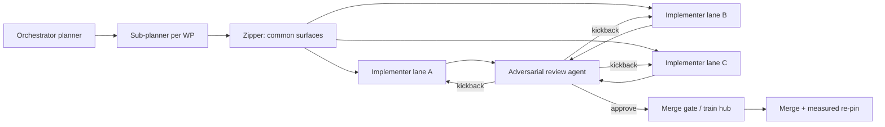

# Agent / workflow pipeline (orchestration shape)

## Stage contracts

### 1. Orchestrator (you / top agent)

**Input:** decisions, execution plan, spike resolutions  
**Output:** ordered list of work packages under `packages/`  
**Must not:** write feature code in component repos during planning

### 2. Sub-planner (optional agent / workflow)

**Input:** one work package  
**Output:** lane packages (one per repo) with narrower success criteria  
**Must:** preserve frozen surface IDs; never invent new public names without zipper lane

### 3. Zipper agent

**Input:** `surfaces/*` for the package  
**Output:** PR(s) that only add:

- public trait/type stubs
- rustdoc contracts
- contract / compliance tests (may be `#[ignore]` until impl)
- docs linking package ID

**Forbidden:** full host implementations, process/net bodies

### 4. Implementer agents (parallel)

**Input:** lane package + pin of zipper PR  
**Output:** green CI PR in **one** component repo  
**Must:** use `ecosystem-lock-ref` + `dep_overrides` for multi-repo co-dev  
**Must not:** edit foreign repos in the same PR

### 5. Adversarial review agent

**Checklist (always):**

- [ ] Does the PR honor frozen signatures (no silent renames)?
- [ ] Never-silent errors on missing host ops / missing GPU / missing lock?
- [ ] Effects declared match actual I/O?
- [ ] Rootless runner assumptions: no apt-get in CI steps unless image job?
- [ ] Action pins come from ap-workflows composition (no random `@v3` drift)?
- [ ] Tests fail when the feature is removed (not tautologies)?
- [ ] No monorepo path deps reintroduced?
- [ ] Scope creep: out-of-package work?

**Output:** `APPROVE` | `KICKBACK` with file:line notes

### 6. Merge gate

- All lanes APPROVE
- Hub checklist complete
- Measured draw-in re-pin only when package marks `requires_repin: true`

## Workflow automation targets (ap-workflows)

| Workflow / artifact | Purpose |
|---------------------|---------|
| `pins/actions.yml` | Single source of latest **stable major** action pins |
| `reusable-ci-rust.yml` | depth, runners, GPU FAIL_ENV, lock materializer |
| `reusable-train-lane.yml` | Validate package JSON + comment hub |
| `templates/agent-kickoff.md` | Prompt body for implementer agents |
| Image builds | Late-stage rootless/minimal; publish GHCR |

## Kickoff rule

Never start an implementer without:

1. Package file merged or on train branch
2. Surface freeze PR linked (or status `pre-freeze` only for pure docs/CI lanes)
3. Hub issue number
4. Success criteria that a machine or reviewer can check
